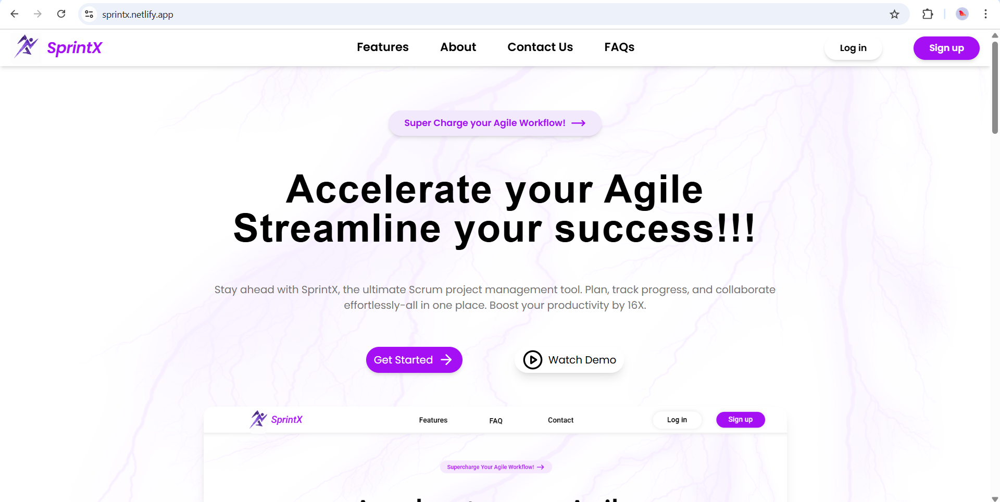
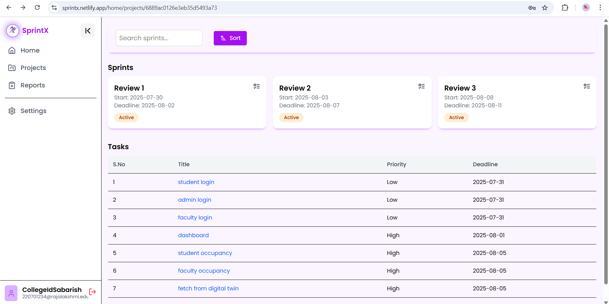

# 👨‍💻 SprintX – Agile Project Management Tool

**SprintX** is a **MERN-based project management tool** built to help teams **track, monitor, and manage software projects efficiently**.  
It is designed with **role-based access**, clear task workflows, individual & team progress tracking, and a **fully responsive design** for all screen sizes.  
SprintX follows a **hybrid Agile-Scrum (Scrumban) approach**, blending Scrum structure with Kanban-inspired task flows for practical real-world usage.

**Live Demo:** [SprintX Live](https://sprintx.netlify.app)

---

## 🚀 Features
- **Role-Based Access Control (RBAC)**  
  - Product Owner, Scrum Master, Team Member  
- **Authentication & Security**  
  - OTP-based email verification  
  - JWT authentication  
  - Password hashing & salting  
- **Agile Hierarchy**  
  - Project → Epic → User Story → Task  
  - Sprints contain multiple user stories  
- **Task Workflow & Kanban Board**  
  - Tasks move through 5 states: To Do → In Progress → Completed → Testing → Need Review (Bug)  
  - **Scrum Master**: View and manage all tasks in a sprint on a Kanban board  
  - **Team Member**: View and drag-and-drop their own tasks to update progress  
- **Reporting & Visualization**  
  - Individual and team reports  
  - Interactive charts using **Recharts**  
- **Responsive Design**  
  - Fully responsive UI for desktops, tablets, and mobile devices  

---

## 🛠️ Tech Stack
- **Frontend:** React, TailwindCSS  
- **Backend:** Node.js, Express.js  
- **Database:** MongoDB  
- **Charts & Visualization:** Recharts  
- **Authentication & Security:** JWT, bcrypt, OTP-based email verification  

---

## 🔄 Project Flow
1. **Project Creation:** Product Owner creates projects and epics.  
2. **Sprint & Story Management:** Scrum Master creates sprints and user stories, assigns tasks to team members.  
3. **Task Execution:**  
   - Team members work on tasks via a **drag-and-drop Kanban board**  
   - Tasks progress through 5 states: To Do → In Progress → Completed → Testing → Need Review  
4. **Progress Tracking & Reporting:**  
   - Individual and team reports are shown using **interactive charts** (Recharts)  
5. **Agile-Scrum Hybrid:**  
   - Structured roles & sprints inspired by Scrum  
   - Flexible task states and Kanban board inspired by practical Agile workflows  

This hybrid approach ensures **Agile compliance while remaining practical** for real-world software development teams.

---

## 📸 Screenshots
### Landing Page

### Home Page

### Sprint and Tasks

### Creating userstory

### Kanban Board

### Report Page

### Settings Page

---

## 🌟 Final Note
SprintX demonstrates how **systematic, role-aware, and secure project management** can improve team efficiency and transparency.  
It’s designed as a **practical and insightful tool** for anyone exploring Agile workflows in software projects.
